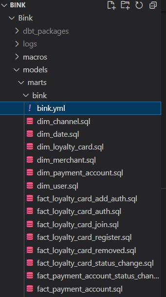

Tests are called from .yaml files

eg bink.yml



They are called by using test: key in the yml file followed by the test name

```yaml
version: 2

models:
    - name: fact_transaction
      description: "Table containing transaction events"
      schema: 'Bink'
      config:
        elementary:
          timestamp_column: inserted_date_time
      columns:
        - name: 'EVENT_ID'
          description: Primary Key of the table
          quote: true
          tests:
            - unique
            - not_null
        - name: 'TRANSACTION_ID'
          description: Busineess PK of the table
          quote: true
          tests:
            - not_null
        - name: 'USER_ID'
          description: Transaction User
          quote: true
          tests:
            - not_null
            - relationships:
                to: ref('dim_user')
                field: USER_ID
        - name: 'PAYMENT_ACCOUNT_ID'
          description: Transaction payment account
          quote: true
          tests:
            - not_null
            - relationships:
                to: ref('dim_payment_account')
                field: PAYMENT_ACCOUNT_ID
        - name: 'LOYALTY_CARD_ID'
          description: Transaction loyalty card account
          quote: true
          tests:
            - not_null
            - relationships:
                to: ref('dim_loyalty_card')
                field: LOYALTY_CARD_ID
        - name: 'MERCHANT_ID'
          description: Links to merchant dim
          quote: true
          tests:
            - not_null
            - relationships:
                to: ref('dim_merchant')
                field: MERCHANT_ID
        - name: 'SPEND_AMOUNT'
          tests:
            - not_null
            - elementary.column_anomalies
```

## Custom tests
### is\_year

This test that the year format is in a format that is usable and within a range that is acceptable.

The range can be moved up and down by changing the years in the source test.

```sql

    SELECT *
    FROM {{ model }}
    WHERE {{ column_name }} < 2000 OR  {{ column_name }} > 2050


```

### is\_month

This test checks if the month number is within the accepted 1 - 12 range.

```sql

    SELECT *
    FROM {{ model }}
    WHERE {{ column_name }} < 1 OR  {{ column_name }} > 12


```

### all\_events\_parsed

This test makes sure all events in the event stream are parsed through to the fact tables.

```sql
with events_src as (
    SELECT EVENT_ID
    FROM {{ ref('stg_hermes__EVENTS')}}
)

 ,fact_tables as (
    
    SELECT TABLE_NAME
    FROM {{target.database}}.INFORMATION_SCHEMA.TABLES
    WHERE TABLE_SCHEMA = '{{target.schema}}'
    AND TABLE_NAME LIKE 'FACT%'
    

    {# Get column list #}
    

    
    {# Return the first column as a list #}
    
    
    
    


    
     UNION ALL 
    SELECT event_id FROM {{target.database}}.{{target.schema}}.{{ item }}
    
)

,events_minus_facts as (
    SELECT EVENT_ID FROM events_src
    EXCEPT 
    SELECT EVENT_ID FROM fact_tables
)

,facts_minus_events as (
    SELECT EVENT_ID FROM fact_tables
    EXCEPT
    SELECT EVENT_ID FROM events_src
)

,sum_except_all as (
    SELECT * FROM events_minus_facts
    UNION ALL
    SELECT * FROM facts_minus_events
)

SELECT * FROM sum_except_all
```

### All loyalty card have payment accounts

Test to ensure every active Barclays loyalty card is matched with a payment card

```sql
WITH new_lc AS (
    SELECT *
    FROM
        {{ref('fact_loyalty_card_join')}}
    WHERE
        EVENT_TYPE = 'SUCCESS'
        AND CHANNEL LIKE '%barclays%'
        AND TIMEDIFF(
                    HOUR, EVENT_DATE_TIME, (
                        SELECT MAX(EVENT_DATE_TIME)
                        FROM {{ref('fact_loyalty_card_join')}}
                        )
                    ) < 24
)
  
SELECT
    USER_ID
FROM
    new_lc
WHERE
    USER_ID NOT IN (SELECT USER_ID FROM {{ref('fact_payment_account')}})
```

### More loyalty cards created than removed

Test to ensure all lc create event shave a corresponding create user event

```sql
with joins AS (
    SELECT *
    FROM {{ ref('fact_loyalty_card_join')}}
    WHERE event_type = 'SUCCESS'
        AND is_most_recent = true
),

removals AS (
    SELECT r.LOYALTY_CARD_ID
    FROM {{ ref('fact_loyalty_card_removed')}} r
        LEFT JOIN joins j ON j.LOYALTY_CARD_ID = r.LOYALTY_CARD_ID
)

SELECT loyalty_card_id
FROM {{ ref('fact_loyalty_card_removed')}}
MINUS
SELECT loyalty_card_id
FROM removals
```

### Loyalty cards in error state

Test to ensure all lc are not ending with error states

```sql
with lc_errors as (
    SELECT
        LOYALTY_CARD_ID
    FROM {{ref('fact_loyalty_card_status_change')}}
    WHERE
        IS_MOST_RECENT = true
        AND TO_STATUS_ID not in (0,1)
        AND TIMEDIFF(
                hour, EVENT_DATE_TIME, (
                    SELECT max(EVENT_DATE_TIME)
                    FROM {{ref('fact_loyalty_card_status_change')}}
                    )
                ) < 24
    )
  
,previously_valid as (
    SELECT
        LOYALTY_CARD_ID
    FROM
        {{ref('fact_loyalty_card_status_change')}}
    WHERE
        LOYALTY_CARD_ID IN (SELECT LOYALTY_CARD_ID FROM lc_errors)
        AND TO_STATUS_ID IN (0,1)
    GROUP BY
        LOYALTY_CARD_ID

)

select * from previously_valid
```

### Loyalty card PLL link

Test to ensure all barclays lc create events have a PLL link

```sql
SELECT
    *
FROM {{ref('fact_loyalty_card_join')}}
WHERE loyalty_card_id NOT IN (
        SELECT loyalty_card_id
        FROM {{ref('join_loyalty_card_payment_account')}}
    )
    AND EVENT_TYPE = 'SUCCESS'
    AND IS_MOST_RECENT = true
    AND CHANNEL LIKE '%barclays%'
    AND TIMEDIFF(hour, EVENT_DATE_TIME, (
            select max(EVENT_DATE_TIME)
            from {{ref('fact_loyalty_card_join')}}
        )
    ) < 24
```

### Payment Account repeat fingerprints

Test to ensure no duplicate fingerprints for a payment account

```sql
WITH new_pa AS (
    SELECT *
    FROM {{ref('fact_payment_account')}}
    WHERE EVENT_TYPE = 'ADDED'
    AND TIMEDIFF(
                        HOUR, EVENT_DATE_TIME, (
                            SELECT MAX(EVENT_DATE_TIME)
                            FROM {{ref('fact_payment_account')}}
                            )
                        ) < 24
)

,fingerprints AS (
    SELECT
        pa.USER_ID
        ,COUNT( DISTINCT dpa.FINGERPRINT) AS DISTINCT_FINGERPRINTS
        ,COUNT( dpa.FINGERPRINT) AS FINGERPRINTS
    FROM new_pa pa
    LEFT JOIN {{ref('dim_payment_account_secure')}} dpa
        ON pa.PAYMENT_ACCOUNT_ID=dpa.PAYMENT_ACCOUNT_ID
    GROUP BY
        USER_ID
)

SELECT *
FROM fingerprints
WHERE DISTINCT_FINGERPRINTS != FINGERPRINTS
```

### Long Payment Accounts Pending time

Test to monitor long delays whilst the payment account is in pending

```sql
WITH new_pa AS (
    SELECT *
    FROM {{ref('fact_payment_account')}}
    WHERE EVENT_TYPE = 'ADDED'
    AND TIMEDIFF(
                        HOUR, EVENT_DATE_TIME, (
                            SELECT MAX(EVENT_DATE_TIME)
                            FROM {{ref('fact_payment_account')}}
                            )
                        ) < 24
)

,wait_times AS (
    SELECT 
        pasc.EVENT_DATE_TIME AS PENDING_DT
        ,pa.EVENT_DATE_TIME AS CREATED_DT
        ,TIMEDIFF(MINUTE,CREATED_DT, PENDING_DT) AS WAIT_MINUTES_PENDING
    FROM new_pa pa
    LEFT JOIN
        {{ref('fact_payment_account_status_change')}} pasc
        ON pa.PAYMENT_ACCOUNT_ID = pasc.PAYMENT_ACCOUNT_ID
)
  
SELECT *
FROM wait_times
WHERE WAIT_MINUTES_PENDING > 10
```

### Match events to create users

Test to ensure all event tables with users have a corresponding create user event

```sql
WITH all_users_from_events as (
    
    SELECT TABLE_NAME
    FROM {{target.database}}.INFORMATION_SCHEMA.TABLES
    WHERE TABLE_SCHEMA = '{{target.schema}}'
    AND TABLE_NAME LIKE 'FACT%'
    AND TABLE_NAME NOT LIKE 'FACT_USER%'
    

    {# Get column list #}
    

    
    {# Return the first column as a list #}
    
    
    
    


    
     UNION 
    SELECT USER_ID FROM {{target.database}}.{{target.schema}}.{{ item }}
    WHERE EVENT_DATE_TIME < (
        SELECT MAX(EVENT_DATE_TIME)
        FROM {{ref('fact_user')}}
        )
    AND EVENT_DATE_TIME > dateadd(day, -1, (
        SELECT MAX(EVENT_DATE_TIME)
        FROM {{ref('fact_user')}}
        )
        )
    
)

, minus_create_users AS (
    SELECT USER_ID FROM all_users_from_events
    MINUS
    SELECT DISTINCT USER_ID
    FROM {{ref('fact_user')}}
)

SELECT *
FROM minus_create_users
```

### All users in dim\_user

Test to ensure all create user events have a matching user in dim\_user

```sql
WITH new_users AS (
    SELECT *
    FROM {{ref('fact_user')}}
    WHERE EVENT_TYPE = 'CREATED'
    AND IS_MOST_RECENT = true
    AND TIMEDIFF(
                        HOUR, EVENT_DATE_TIME, (
                            SELECT MAX(EVENT_DATE_TIME)
                            FROM {{ref('fact_user')}}
                            )
                        ) < 24
)

SELECT *
FROM new_users
WHERE user_id NOT IN (SELECT user_id from {{ref('dim_user')}})
```

### Consecutive create user events

Test to ensure no create user events are followed by another create user event

```sql
WITH all_events AS (
    SELECT USER_ID,"EVENT_TYPE"
        ,LEAD("EVENT_TYPE") OVER
            (PARTITION BY USER_ID ORDER BY EVENT_DATE_TIME, EVENT_ID)
            AS NEXT_EVENT
    FROM {{ref('fact_user')}}
    WHERE "EVENT_TYPE" = 'CREATED'
    AND TIMEDIFF(
                hour, EVENT_DATE_TIME, (
                    SELECT max(EVENT_DATE_TIME)
                    FROM {{ref('fact_user')}}
                    )
                ) < 24
)

,consecutive_creates AS (
    SELECT *
    FROM all_events
    WHERE NEXT_EVENT = 'CREATED'
)

SELECT *
FROM consecutive_creates
```

## Generic Tests

### Daily Spike SD

Tests for daily spikes in the count of values in a particular column. Errors for a count about a multiple of the standard deviation across the past 60 days.

```yaml
        - name: 'SPEND_CURRENCY'
          description: GBP
          quote: true
          tests:
            - sd_daily_spike:
                vals: ['GBP']
                datetime_col: EVENT_DATE_TIME
                unique_id_col: EVENT_ID
                max_sd: 2
```

### Unique

The unique test checks the uniqueness of a column. This test is used on all primary keys entering the warehouse and all keys to be used in joining throughout the warehouse.

```yaml
    - name: fact_user
      description: "Table containing events for user creation / deletion"
      schema: 'Bink'
      columns:
        - name: EVENT_ID
          description: Unique event ID
          quote: true
          tests:
            - unique
            - not_null
```

### Not null

The not null test checks that the column does not contain any nulls. It is used again on primary keys and linking columns as well as columns within facts and other columns that a recognised cannot be null.

```yaml
    - name: fact_user
      description: "Table containing events for user creation / deletion"
      schema: 'Bink'
      columns:
        - name: EVENT_ID
          description: Unique event ID
          quote: true
          tests:
            - unique
            - not_null
```

### Accepted values

The accepted values test only allows the prespecified items in a category to be in the column anything other than this will error. In the case created and deleted. It is case sensitive

```yaml
    - name: fact_user
      description: "Table containing events for user creation / deletion"
      schema: 'Bink'
      columns:
        - name: EVENT_ID
          description: Unique event ID
          quote: true
          tests:
            - unique
            - not_null
        - name: 'EVENT_TYPE'
          description: Created or deleted
          quote: true 
          tests:
            - not_null
            - accepted_values:
                values: ['CREATED', 'DELETED']
        - name: USER_ID
          description: Business PK
          quote: true
          tests:
            - not_null
            - relationships:
                to: ref('dim_user')
                field: USER_ID
```

### Relationships

This test is for the referential integrity between two tables. Linking items from a fact table cannot be null in a Dimension table.

```yaml
    - name: fact_user
      description: "Table containing events for user creation / deletion"
      schema: 'Bink'
      columns:
        - name: EVENT_ID
          description: Unique event ID
          quote: true
          tests:
            - unique
            - not_null
        - name: 'EVENT_TYPE'
          description: Created or deleted
          quote: true 
          tests:
            - not_null
            - accepted_values:
                values: ['CREATED', 'DELETED']
        - name: USER_ID
          description: Business PK
          quote: true
          tests:
            - not_null
            - relationships:
                to: ref('dim_user')
                field: USER_ID
```

### Anomaly detection

Anomaly detection tests for large increases or decreases across columns in output tables eg a huge increase in sign ups.

## Logs

Test logs can have 4 different states Pass , Fail, Run, Error.

### Pass

The test has passed all is good. And the next command can run

### Fail

Fail means the test has failed it usually has the number of rows the test failed on if it is a numeric test. Fail also means that dbt will not move on to the next command.

### Warn

Warn means the test has failed but it is set to warn rather than error and will move on to the next dbt command. It also has the number of rows the test failed on.

### Error

Error means that there has been an SQL compilation error on a custom test

```
10:38:57  1 of 183 START test accepted_values_fact_loyalty_card_add_auth__EVENT_TYPE___REQUEST__FAILED__SUCCESS [RUN]
10:38:58  1 of 183 PASS accepted_values_fact_loyalty_card_add_auth__EVENT_TYPE___REQUEST__FAILED__SUCCESS [PASS in 1.25s]

10:39:08  12 of 183 START test all_events_parsed.......................................... [RUN]
10:39:10  12 of 183 ERROR all_events_parsed............................................... [ERROR in 1.49s]

10:39:10  13 of 183 START test elementary_column_anomalies_fact_transaction_SPEND_AMOUNT.. [RUN]
10:39:12  Elementary: Started running data monitors on: DEV.BINK.FACT_TRANSACTION SPEND_AMOUNT
10:39:13  Elementary: Finished running data monitors on: DEV.BINK.FACT_TRANSACTION SPEND_AMOUNT
10:39:13  13 of 183 PASS elementary_column_anomalies_fact_transaction_SPEND_AMOUNT........ [PASS in 3.52s]


10:41:08  111 of 183 START test relationships_fact_payment_account_status_change__PAYMENT_ACCOUNT_ID___PAYMENT_ACCOUNT_ID__ref_fact_payment_account_ [RUN]    
10:41:10  111 of 183 FAIL 135 relationships_fact_payment_account_status_change__PAYMENT_ACCOUNT_ID___PAYMENT_ACCOUNT_ID__ref_fact_payment_account_ [FAIL 135 in 1.75s]

10:41:29  137 of 183 START test source_unique_HARMONIA_LOYALTY_SCHEME_ID.................. [RUN]
10:41:30  137 of 183 WARN 8 source_unique_HARMONIA_LOYALTY_SCHEME_ID...................... [WARN 8 in 0.40s]
```

Below is example of more details on the logs with relation to fails , errors and warns.

```
Completed with 5 errors and 3 warnings:
10:42:19
10:42:19  Database Error in test all_events_parsed (tests\single\all_events_parsed.sql)
10:42:19    001003 (42000): SQL compilation error:
10:42:19    syntax error line 20 at position 4 unexpected ')'.
10:42:19    syntax error line 22 at position 23 unexpected '('.
10:42:19    syntax error line 26 at position 0 unexpected ')'.
10:42:19    compiled SQL at target\run\Bink\tests\single\all_events_parsed.sql
10:42:19
10:42:19  Failure in test relationships_fact_payment_account_status_change__PAYMENT_ACCOUNT_ID___PAYMENT_ACCOUNT_ID__ref_fact_payment_account_ (models\marts\bink\bink.yml)
10:42:19    Got 135 results, configured to fail if != 0
10:42:19
10:42:19    compiled SQL at target\compiled\Bink\models\marts\bink\bink.yml\relationships_fact_payment_acc_3c62e9d61a2a963111d286ce896f57b1.sql
10:42:19
10:42:19  Failure in test relationships_fact_user__USER_ID___USER_ID__ref_dim_user_ (models\marts\bink\bink.yml)
10:42:19    Got 2 results, configured to fail if != 0
10:42:19  
10:42:19    compiled SQL at target\compiled\Bink\models\marts\bink\bink.yml\relationships_fact_user__USER_ID___USER_ID__ref_dim_user_.sql
10:42:19
10:42:19  Failure in test unique_dim_merchant__MERCHANT_ID_ (models\marts\bink\bink.yml)
10:42:19    Got 413 results, configured to fail if != 0
10:42:19
10:42:19    compiled SQL at target\compiled\Bink\models\marts\bink\bink.yml\unique_dim_merchant__MERCHANT_ID_.sql
10:42:19
10:42:19  Failure in test unique_join_loyalty_card_payment_account__PLL_LINK_ID_ (models\marts\bink\bink.yml)
10:42:19    Got 28277 results, configured to fail if != 0
10:42:19
10:42:19    compiled SQL at target\compiled\Bink\models\marts\bink\bink.yml\unique_join_loyalty_card_payment_account__PLL_LINK_ID_.sql
10:42:19
10:42:19  Warning in test source_unique_HARMONIA_LOYALTY_SCHEME_ID (models\staging\harmonia\src_harmonia.yml)
10:42:19    Got 8 results, configured to warn if != 0
10:42:19
10:42:19    compiled SQL at target\compiled\Bink\models\staging\harmonia\src_harmonia.yml\source_unique_HARMONIA_LOYALTY_SCHEME_ID.sql
10:42:19
10:42:19  Warning in test source_unique_HARMONIA_MERCHANT_IDENTIFIER_ID (models\staging\harmonia\src_harmonia.yml)
10:42:19    Got 4927 results, configured to warn if != 0
10:42:19
10:42:19    compiled SQL at target\compiled\Bink\models\staging\harmonia\src_harmonia.yml\source_unique_HARMONIA_MERCHANT_IDENTIFIER_ID.sql
10:42:19
10:42:19  Warning in test source_unique_HARMONIA_PAYMENT_PROVIDER_ID (models\staging\harmonia\src_harmonia.yml)
10:42:19    Got 3 results, configured to warn if != 0
10:42:19
10:42:19    compiled SQL at target\compiled\Bink\models\staging\harmonia\src_harmonia.yml\source_unique_HARMONIA_PAYMENT_PROVIDER_ID.sql
```
